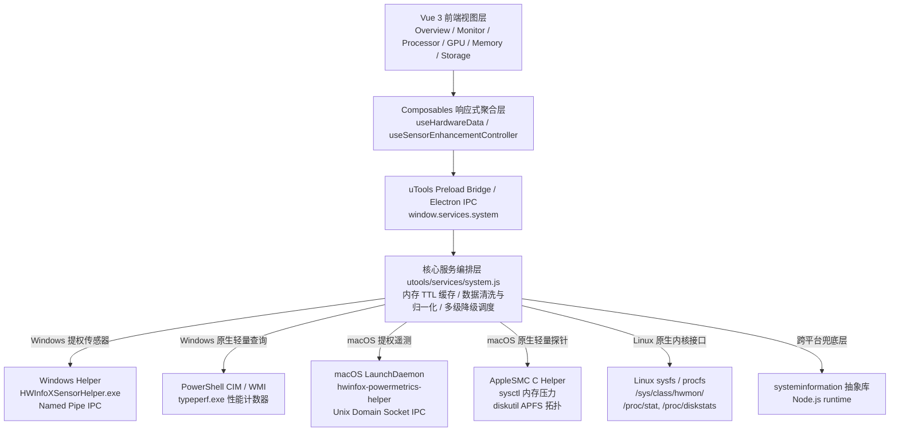
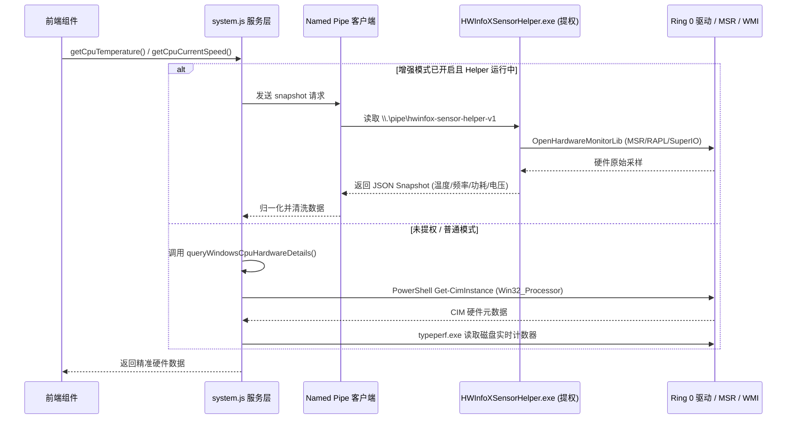
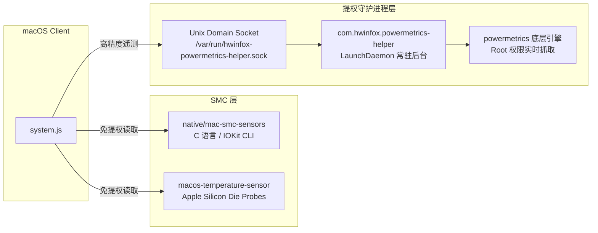
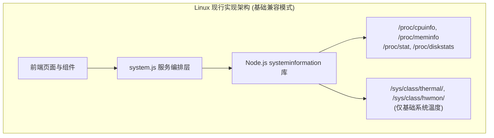

# 跨平台硬件信息与遥测实现技术文档 (macOS / Windows / Linux)

本插件是面向 **uTools** 与 **Electron** 环境的高性能硬件信息监控工具。为了在不同操作系统上兼顾**高精度数据采集**、**系统性能开销**与**普通用户免配置开箱即用**的体验，插件针对 **Windows**、**macOS** 与 **Linux** 设计了差异化的硬件遥测采集链、IPC 通信机制与优雅降级方案。

---

## 1. 总体架构与数据流设计

插件采用分层解耦架构，从上到下划分为：**前端展示层**、**uTools / Electron 运行时桥接层**、**服务编排与缓存层**、以及**平台原生 / 提权辅助采集层**。



### 1.1 分层核心原则
1. **UI 与平台逻辑彻底解耦**：Vue 组件只消费标准化的响应式接口（如 `CpuData`, `GpuData`, `MemoryInfo`），不包含任何平台专有分支判断；所有平台差异化清洗与修正在服务层完成。
2. **多级平滑降级（Graceful Degradation）**：
   - **第一优先级**：平台专用的高精度原生/提权 Helper（提供实时频率、精确功耗、MSR 核心温度、风扇转速）。
   - **第二优先级**：平台自带的轻量级低开销 CLI 或系统 API（如 Windows `typeperf`、macOS `sysctl`、Linux `sysfs`）。
   - **第三优先级**：通用 Node.js `systeminformation` 基础库。
   - **兜底**：返回语义明确的占位数据与错误原因诊断，保证界面不白屏、不崩溃。
3. **分级内存缓存（In-Memory TTL Caching）**：
   - 高频变动指标（CPU 负载、存储 IO、网络速率）：缓存 1.5s ~ 2s。
   - 动态变动指标（温度、功耗、电压、时钟频率）：缓存 2s ~ 5s。
   - 静态规格指标（CPU 型号、主板 BIOS、内存规格、磁盘拓扑）：缓存 30s。
   - 当传感器 Helper 异步启动就绪时，主动调用 `invalidateRuntimeServiceCache()` 立即唤醒数据刷新，避免展示陈旧的占位信息。

---

## 2. Windows 平台技术实现

Windows 是硬件异构性最高（Intel/AMD 平台、不同芯片组、不同 Super I/O 控制器）、权限隔离最严格的操作系统。插件针对 Windows 实现了**无感免提权模式**与**提权传感器增强模式**的双轨驱动体系。



### 2.1 无感免提权模式 (Unprivileged Standard Mode)

在用户未开启或尚未授权管理员权限时，插件依然能准确采集到基础硬件信息，并修复了通用库中的大量常见 Bug：

1. **WMI / CIM 硬件元数据校准 (`queryWindowsCpuHardwareDetails`)**：
   - **固件虚拟化误报修正**：通用库 `systeminformation` 在未安装 Hyper-V 角色时，经常将 CPU 虚拟化状态误报为关闭。插件直接通过底层 `Get-CimInstance Win32_Processor` 获取真实的 `VirtualizationFirmwareEnabled`。
   - **物理插槽名称校正**：直接提取 `SocketDesignation`（如 `AM4`, `AM5`, `LGA1700`），避免被错误的旧规范 `UpgradeMethod` 覆盖。
   - **L1 缓存单位校准**：`Win32_CacheMemory` 在返回统一 L1 缓存（Cache Type 5）时，某些平台以 KB 计量，容易导致上层乘以 1024 产生虚高的数百兆缓存。插件通过核心数合理性检验自动换算校准。
2. **频率口径对齐（对齐 Windows 任务管理器）**：
   - Windows 任务管理器展示的“当前频率”并非单核瞬时睿频，而是全核动态加权平均值。
   - 插件在 `src/utils.ts` 与组件中优先使用 `speed.avg` 作为主卡片显示频率，并在卡片底部提供 `单核最高`（Peak Boost Clock）辅助说明，既消除用户与任务管理器对比时的割裂感，又保留了游戏玩家关注的瞬时爆发睿频。
3. **微秒级低开销磁盘性能监控 (`typeperf.exe`)**：
   - Windows 下高频查询 WMI 磁盘性能会导致 WmiPrvSE.exe 占用 CPU 并产生明显卡顿。
   - 插件直接调用原生 `typeperf.exe` 单次采样 `\PhysicalDisk(_Total)\*` 计数器：
     - `Disk Read Bytes/sec` / `Disk Write Bytes/sec`（实时吞吐）
     - `Disk Reads/sec` / `Disk Writes/sec`（IOPS）
     - `% Disk Time`（磁盘繁忙利用率）
     - `Avg. Disk Queue Length`（平均队列深度）
   - 单次执行通常在 50~100ms 内完成，性能开销极低。

### 2.2 提权传感器增强模式 (Privileged Hardware Sensor Enhancement)

为了深入 CPU 内部 MSR 寄存器（读取 Intel RAPL 功耗、AMD Zen 遥测、核心 VID 电压）以及主板 Super I/O 芯片（读取风扇转速与主板传感器），插件自主构建了 C# 辅助进程 `HWInfoXSensorHelper.exe`。

#### A. 安全与完整性级别突破 (MIC & DACL)
- **挑战**：提权后的 Helper 运行在 **High Integrity Level**（高完整性级别），而 uTools 渲染进程与 Node.js 扩展运行在普通用户的 **Medium Integrity Level**（中完整性级别）。Windows 默认的安全机制（Mandatory Integrity Control, MIC）会直接拦截中完整性进程连接高完整性 Named Pipe，抛出 `Access Denied`。
- **解决方案 (`native/windows-sensor-helper/Program.cs`)**：
  1. Helper 启动后激活当前进程令牌的 `SeSecurityPrivilege`。
  2. 构建自定义 DACL，明确赋予当前用户及 `BuiltinAdministrators` 读写权限。
  3. 通过 Win32 API `SetSecurityInfo` 为 Named Pipe 注入 `SECURITY_MANDATORY_LOW_RID` / `SECURITY_MANDATORY_MEDIUM_RID` 标签：
     ```csharp
     ConvertStringSidToSid("S-1-16-4096", out lowIntegritySid); // Low Mandatory Level
     SetSecurityInfo(pipeHandle, SeKernelObject, LabelSecurityInformation, ...);
     ```
  4. 既保证了 IPC 通信仅限于本机同一登录用户，又彻底解决了 UAC 提权后的管道权限阻断。

#### B. 异构多核与 AMD Zen 拓扑均匀映射算法
- **挑战**：AMD Ryzen 桌面处理器（如 Ryzen 9 5900X / 7900X / 9900X / 9950X 等）采用 MCM（多芯片封装）架构，硬件传感器只暴露 `Tctl/Tdie`、`CCD1 Temperature` 和 `CCD2 Temperature`，并不提供单个物理核心的独立测温二极管。如果简单读取，会导致核心温度列表为空或单核全显示 0℃。
- **解决方案 (`utools/services/system.js`)**：
  - 插件引入拓扑自适应派发算法：
    1. 动态探测是否存在 `CCD #1` / `CCD #2` 等传感器节点。
    2. 获取 CPU 实际物理核心数，计算每个 CCD 包含的核心数量 `coresPerCcd = physicalCores / ccdCount`。
    3. 将 CCD 传感器温度均匀扩展映射至对应物理核心阵列，使前端核心温控热力图、多核折线图能够忠实呈现各核心所属 CCD 的热工状态。

#### C. 稳健的生命周期管理
- **单实例互斥**：利用全局命名互斥体 `Global\HWInfoXSensorHelper_SingleInstance_Mutex` 防止重复拉起。
- **空闲自动退出**：Helper 内置 30 分钟无请求看门狗，当用户关闭监控页面或退出 uTools 达到阈值后自动安全释放驱动与退出，杜绝后台常驻占用。
- **管道防抖与异常恢复**：`windowsSensorHelper.js` 维护状态探测重试与优雅销毁，避免 `StreamWriter.Dispose` 产生 Broken Pipe 异常。

---

## 3. macOS 平台技术实现

macOS 具有封闭的驱动模型，Apple Silicon（M1/M2/M3/M4 系列）全面转向 SoC 统一内存架构，其电源管理、热管理与传统 x86 PC 完全不同。插件针对 macOS 打造了 **SMC 免提权探针** 与 **LaunchDaemon 提权遥测守护引擎**。



### 3.1 免提权原生探针 (`native/mac-smc-sensors`)
- **IOKit 与 AppleSMC 通信**：
  - 采用 C 语言原生编译二进制辅助程序，利用 IOKit 服务树中的 `AppleSMC` 驱动接口。
  - **SMC Key 读取**：
    - CPU 温度：轮询 `TC0P`、`TC0E`、`TC0F`、`TC0D` 等温度键值。
    - GPU 温度：读取 `TG0P`、`TG0D`。
    - 风扇转速：解析 `F0Ac`、`F1Ac`（实测 RPM）与 `F0Mn`/`F0Mx`（转速上下限）。
- **Apple Silicon 片上探针 (`vendor/macos-temperature-sensor`)**：
  - 加载针对 ARM64 SoC 编译的原生扩展，直接读取集成于芯片内部各性能核（P-Core）、能效核（E-Core）及 GPU 核心的片上数字热敏二极管。

### 3.2 提权遥测守护进程 (`native/macos-powermetrics-helper`)
- **背景**：Apple Silicon 芯片的实时各核心集群真实工作频率（E-Cluster / P-Cluster）、SoC 真实功耗（CPU Package Power、GPU Power、Apple Neural Engine ANE Power）被苹果严格封装在需要 root 权限的 `powermetrics` 系统接口中。普通应用既无权限调用，也无法高频承受 `sudo` 产生的授权弹窗与进程创建开销。
- **架构设计**：
  1. **安装部署**：一次性安装特权守护配置 `/Library/LaunchDaemons/com.hwinfox.powermetrics-helper.plist`，二进制部署至 `/Library/Application Support/HWInfoX/`。
  2. **Socket 监听**：常驻守护进程启动后监听本地 Unix Domain Socket：`/var/run/hwinfox-powermetrics-helper.sock`。
  3. **采样与解析**：
     - Helper 在 root 环境下调度 `powermetrics -n 1 -s cpu_power,gpu_power`。
     - 高性能解析 plist/XML 输出流，提取各 CPU Cluster 的微秒级活跃频率、GPU 实际工作频率与各部分功耗毫瓦（mW）值。
     - 前端通过 Socket 以毫秒级延迟获取结构化 JSON，实现丝滑的动态功耗与频率曲线展示。

### 3.3 macOS 专有系统特性适配
1. **内存压力机制（Memory Pressure）取代 Free Memory**：
   - macOS 采用极进取的内存缓存策略，通常物理内存会被全部填满以提高文件与程序命中率，传统的 `free` 内存通常长期低于 5%，容易给用户造成“内存不足”的假象。
   - 插件直接调用 `sysctl` 读取内核级指标：
     - `kern.memorystatus_vm_pressure_level`（1=Normal 正常, 2=Warning 告警, 4=Critical 严重）
     - `kern.memorystatus_level`（剩余可用系统资源百分比）
   - 完美对齐 macOS 官方“活动监视器”的“内存压力”仪表盘。
2. **APFS 存储拓扑去重 (`parseMacDiskutilTopology`)**：
   - APFS（Apple File System）下存在大量的 Container（容器）与 Synthesized（合成卷组，如 System、Data、Preboot、Update、VM、Recovery），传统磁盘枚举会返回大量相同大小的重复卷。
   - 插件调用 `diskutil info`，根据 `Virtual: Yes/No` 与 `APFS Physical Store` 锚定底层真实物理 SSD，过滤虚拟合成卷，呈现清晰的物理存储布局。
3. **网卡硬件映射**：
   - 调用 `/usr/sbin/system_profiler SPEthernetDataType -json` 解析物理网卡供应商（如 Broadcom、Apple 网卡），精准将 BSD 设备名（`en0`, `en1`）与硬件信息关联。

---

## 4. Linux 平台实现现状与定位

与 Windows 和 macOS 拥有深度定制的原生 Helper 不同，**当前插件在 Linux 平台主要依托 Node.js `systeminformation` 基础库提供常规基础信息，未实现专门的提权守护进程与传感器增强模式（在前端标记为 `unsupported`）**。



### 4.1 当前 Linux 已实现能力
1. **基础规格与性能**：
   - CPU 型号、主频、核心数及基本利用率（通过 `/proc/cpuinfo` 与 `/proc/stat`）。
   - 内存与 Swap 总量、已用量及 `MemAvailable` 真实可用量（通过 `/proc/meminfo`）。
   - 存储空间分区与磁盘 I/O 基础吞吐（通过 `/proc/diskstats` 与 `df` / `lsblk`）。
   - 网卡流量与 IP 信息（通过 `/proc/net/dev`）。
2. **基础温度采集**：
   - `systeminformation.cpuTemperature()` 可自动读取系统识别出的 `/sys/class/thermal/` 或部分 `/sys/class/hwmon/` 节点。

### 4.2 当前 Linux 尚未实现的能力（降级为 unsupported）
1. **无独立的 Native Helper**：未部署类似 Windows C# Helper 或 macOS LaunchDaemon 的常驻辅助进程。
2. **传感器增强模式（Sensor Enhancement）**：`src/utils/platform.ts` 中针对 Linux 返回 `unsupported`，相关控制开关与调试菜单在 Linux 上隐藏。
3. **低层硬件遥测缺失**：
   - **CPU 实时功耗 (Package Power)**：Linux 下未接入 RAPL 功耗读取，返回不支持 (`null`)。
   - **CPU 核心电压 (Vcore / VID)**：未接入 Linux hwmon 电压采集，返回不支持 (`null`)。
   - **CPU 风扇转速 (Fan RPM)**：未接入 Linux Super I/O 风扇采集，返回不支持 (`null`)。
   - **GPU 深度遥测**：仅支持 `systeminformation` 基础探测（若有 `nvidia-smi` 可部分读取，无针对 AMD/Intel 的深度 DRM 驱动读取）。

---

## 5. 跨平台核心指标实现状态对比矩阵

| 硬件遥测指标 | Windows (普通模式) | Windows (增强模式) | macOS (普通模式) | macOS (增强模式) | Linux (现状：仅基础兼容) |
| :--- | :--- | :--- | :--- | :--- | :--- |
| **功能实现状态** | **已完全实现** | **已完全实现** | **已完全实现** | **已完全实现** | **仅基础信息实现，无增强模式** |
| **CPU 基本信息** | WMI CIM 硬件修正 | 同左 | `sysctl` + `si` | 同左 | `si` (`/proc/cpuinfo`) |
| **CPU 虚拟化** | CIM 固件状态校准 | 同左 | `sysctl kern.hv_support` | 同左 | `si` (`/proc/cpuinfo` flags) |
| **CPU 当前频率** | WMI 任务管理器对齐 | MSR 核心时钟 (OHM) | `si.cpuCurrentSpeed` | LaunchDaemon `powermetrics` | `si` (`/proc/cpuinfo` / cpufreq) |
| **CPU 核心负载** | 性能计数器 (SMT 聚合) | 同左 | `host_processor_info` | 同左 | `si` (`/proc/stat` 差分) |
| **CPU 温度** | WMI / ACPI (通常缺失) | MSR DTS + AMD CCD 映射 | SMC C 探针 / AppleSilicon | 同左 | `si` (hwmon/thermal 基础读取) |
| **CPU 功耗** | 无法获取 | Intel RAPL / AMD Core Pwr | 无法获取 | `powermetrics` SoC/CPU W | **未实现 (返回 null)** |
| **CPU 核心电压** | 无法获取 | Vcore / VID (V) | 不支持 | 不支持 | **未实现 (返回 null)** |
| **散热风扇** | 无法获取 | Super I/O 芯片 (RPM) | AppleSMC `F0Ac` | 同左 | **未实现 (返回 null)** |
| **GPU 遥测** | `si` / DirectX 基础信息 | OHM 传感器库 (N/A/I) | `systeminformation` | `powermetrics` 动态遥测 | 仅依赖 `si` (`nvidia-smi` 基础探测) |
| **内存健康度** | 物理已用 / 可用 | 同左 | 内存压力 `sysctl vm_pressure` | 同左 | `si` (`MemAvailable` 真实可用) |
| **磁盘实时 I/O** | `typeperf.exe` 单次采样 | 同左 | `si.disksIO()` | 同左 | `si` (`/proc/diskstats` 差分) |
| **磁盘拓扑** | `Win32_DiskDrive` | 同左 | `diskutil` 过滤 APFS 合成卷 | 同左 | `si` (`lsblk` 拓扑) |
| **系统权限要求** | 普通用户权限 | 管理员权限 (UAC 提权) | 普通用户权限 | Root 权限 (LaunchDaemon) | 普通用户权限 |

---

## 6. 构建、验证与工程化规范

为确保跨平台代码的可维护性与稳定性，项目建立了严格的工程与构建流程：

1. **预构建资产与指纹校验**：
   - Windows C# Helper 源码位于 `native/windows-sensor-helper/`，日常构建不依赖现场编译 C#，而是通过 `npm run verify:windows-helper` 校验 `vendor/openhardwaremonitor/sensor-helper/` 中的预构建二进制、DLL、manifest 与源码 SHA256 指纹。
   - 文本指纹计算前强制规范化 CRLF 与 LF，避免跨操作系统 Git 检出导致校验虚假失败。
2. **运行时动态解压与缓存失效策略**：
   - 插件在打包为 asar 后，原生 `.exe` 和 `.dll` 无法直接由系统执行。
   - 运行时解压时，以当前 Helper 版本号或二进制指纹作为缓存目录唯一识别符，当插件升级发布新版本后，自动在新目录释放运行，防止与老版本旧缓存发生冲突。
3. **统一自动化测试体系**：
   - 每次修改核心服务逻辑后，必须运行对应的回归测试：
     ```powershell
     node tests/windowsCpuNormalization.test.cjs
     node tests/serviceReader.test.cjs
     npx vue-tsc --noEmit
     npm run build
     ```
   - 确保类型安全、逻辑一致与多入口打包完整无误。
